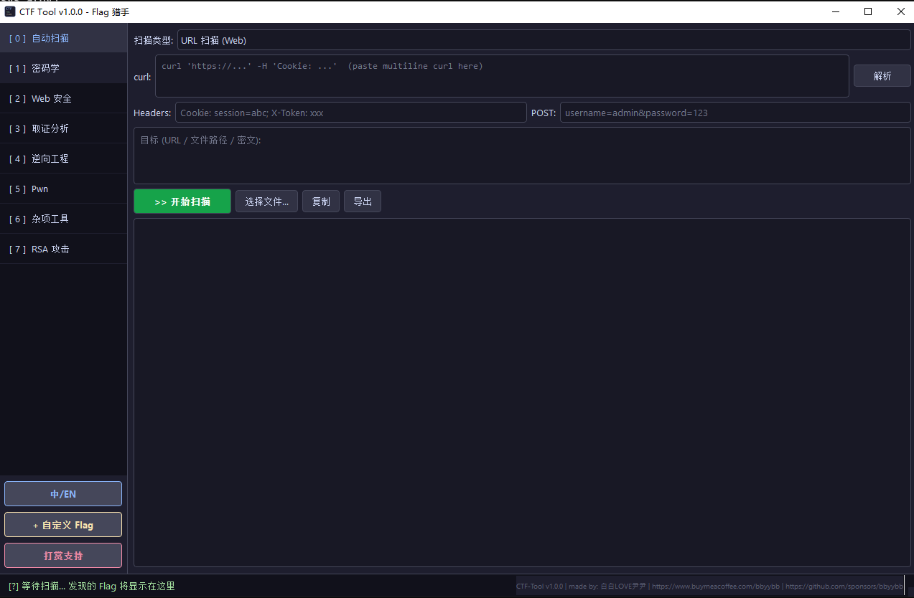
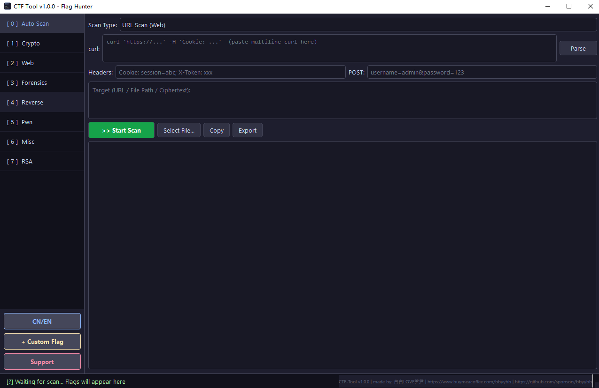

# CTF-Tool

> All-in-one CTF toolkit with GUI — Crypto / Web / Forensics / Reverse / Pwn / Misc / Blockchain
>
> 全场景 CTF 竞赛工具箱 — 密码学 / Web / 取证 / 逆向 / Pwn / 杂项

[](https://github.com/bbyybb/ctf-tool/actions/workflows/ci.yml)
[](https://opensource.org/licenses/MIT)
[](https://www.python.org/)

---

## Features / 功能

| Module / 模块 | Capabilities / 功能 |
|--------|-------------|
| **Crypto / 密码学** | Base64/32/58/62/85/91, Hex, URL, ROT13/47, Caesar, Vigenere (+ auto crack), Playfair, Hill, Polybius, Columnar transposition, Affine, Rail Fence, Atbash, Bacon, Autokey, Nihilist, Book cipher, AES-ECB/CBC/CTR, DES, 3DES, Blowfish, RC4, XOR (single + multi-byte auto crack), RSA (13 attacks incl. multi-prime & dq leak), CRT, ECC/DLP, MT19937 predict, Padding Oracle helper, CRC32, HMAC, Hash crack, Hash length extension, Frequency analysis, Rabin (e=2), Batch GCD, Franklin-Reiter, Coppersmith/Boneh-Durfee helper, Williams p+1, RSA key import (PEM/DER), Hash collision, Password strength |
| **Web / Web 安全** | SQLi / XSS / LFI / CMDi / SSRF / SSTI / XXE / CORS / Path Traversal detection, HTTP Smuggling detect, WAF detect, JWT forge & crack (custom wordlist), Payload generation (8 types), Multi-threaded 75+ path scan, POST support, Open Redirect, CRLF, Prototype Pollution helper, Race Condition helper, Deserialization helper, SVN/.DS_Store/.env leak, Backup file scan, GraphQL introspection, Host header injection, JSONP hijacking, Swagger/OpenAPI detection, SQLi auto exploit chain, Directory listing crawl, SQLi time-based blind |
| **Forensics / 取证** | 51 file signatures, Stego (LSB bit-plane 0-7 / trailing), Audio spectrogram, PNG CRC repair, Channel split, GIF frame extract, EXIF GPS + tampering detect, ZIP/RAR crack (~20K dict), PDF analysis, File repair, PCAP (+ HTTP extract + DNS tunnel), USB keyboard & mouse decode, Binwalk carving, DTMF decode, Office analysis, Memory dump, NTFS ADS, Disk image, Email header, Registry, File timeline, Steghide crack, Zsteg auto scan, Blind watermark, APNG extract, SSTV helper, Stego full scan, Precise file carving, Memory forensics enhanced |
| **Reverse / 逆向** | PE/ELF analysis, ELF checksec (NX/RELRO/PIE/Canary), PE checksec (DEP/ASLR/CFG/SafeSEH/GS), Disassembly (x86/x64/ARM/MIPS), PE 64-bit auto detect, .pyc decompile, Packer detection (UPX/VMProtect/...), Import/Export table, APK analysis, .NET analysis, Go/Rust binary analysis, YARA scan, String deobfuscation |
| **Pwn** | De Bruijn pattern (32+64 bit), Buffer overflow, Format string (read/write x86/x64), ROP gadgets with virtual addr, Shellcode (+ custom bad chars), ret2libc/ret2syscall/ret2csu/SROP/Stack pivot/GOT overwrite/IO_FILE/Heap exploit (tcache/fastbin/house_of_force/house_of_orange)/seccomp helper templates, Auto ret2text/ret2shellcode/comprehensive Pwn analysis |
| **Misc / 杂项** | Morse, Braille, T9, Tap code, Zero-width stego, PHP deserialize, Brainfuck/Ook!/Whitespace, JWT, QR (decode+generate), Barcode, Base100 emoji, DNA cipher, Core values (base-12), Pigpen, Bacon encode, Vigenere auto crack, Wordlist generator (file export), Semaphore, NATO, Leet speak, Baudot, Coord convert, Emoji cipher, Manchester encoding, Color hex decode, Dancing men, Word frequency, Enigma, Pixel extract, Keyboard layout convert, UUencode/XXencode, Quoted-Printable, Audio Morse decode, Piet/Malbolge, EBCDIC |

| **Blockchain / 区块链** | Solidity vuln detection (reentrancy/overflow/tx.origin/selfdestruct/unchecked call), ABI decode/encode, Selector lookup, EVM bytecode disassembly, Storage layout helper, Flash loan/Reentrancy exploit templates, EVM puzzle helper, Common patterns cheatsheet |

**Core / 核心特性:**
- Auto flag detection with recursive decode / 自动 Flag 检测引擎（递归解码）
- Custom flag format with persistent storage / 自定义 Flag 格式（永久存储）
- Auto scanner: URL / File / Text auto-dispatch / 自动扫描调度（智能分派 + 并行执行）
- CLI / PyQt6 GUI / TUI triple mode / CLI 命令行 + PyQt6 桌面 + 终端三模式
- JSON/HTML scan report export / JSON/HTML 扫描报告导出
- Batch scanning (multi-file, multi-URL) / 批量扫描
- Operation history / 操作历史记录
- Chinese/English language switch / 中英文切换
- Output syntax highlighting (flag/URL/IP colored) / 输出语法高亮
- i18n translations externalized to JSON / i18n 翻译外置为 JSON
- 537 unit tests / 537 个单元测试

## Screenshots / 界面截图

| 中文界面 | English UI |
|:---:|:---:|
|  |  |

## Documentation / 文档

- **[完整操作手册 / Usage Guide](docs/USAGE.md)** — 所有模块的详细使用说明、CLI 示例、配置方法、常见问题

## Quick Start / 快速开始

### From Source / 从源码运行

```bash
git clone https://github.com/bbyybb/ctf-tool.git
cd ctf-tool
pip install -r requirements.txt
python main.py          # GUI mode / GUI 模式
python main.py --tui    # TUI mode / 终端模式
python main.py cli crypto rot13 "synt{grfg}"  # CLI mode / 命令行模式
```

### From Release / 下载发行版

Download from [Releases](https://github.com/bbyybb/ctf-tool/releases):

从 [Releases](https://github.com/bbyybb/ctf-tool/releases) 下载对应平台版本：

| Platform / 平台 | File / 文件 |
|----------|------|
| Windows x64 | `ctf-tool-windows-x64-v*.zip` |
| macOS Apple Silicon (M1/M2/M3) | `ctf-tool-macos-arm64-v*.tar.gz` |
| macOS Intel | `ctf-tool-macos-x64-v*.tar.gz` |
| Linux x64 | `ctf-tool-linux-x64-v*.tar.gz` |

## Configuration / 配置说明

CTF-Tool stores user configuration in `~/.ctf-tool/`:

CTF-Tool 的用户配置存储在 `~/.ctf-tool/` 目录下：

| File / 文件 | Description / 说明 |
|---|---|
| `language.json` | Language preference (zh/en) / 语言设置 |
| `flag_patterns.json` | Custom flag regex patterns / 自定义 Flag 匹配规则 |
| `history.json` | Operation history (max 500 entries) / 操作历史（最多 500 条） |

### Optional Dependencies / 可选依赖

Some features require additional packages / 部分功能需要额外安装：

```bash
pip install pyzbar       # QR / Barcode decode / 二维码解码
pip install rarfile      # RAR password crack / RAR 密码爆破
pip install uncompyle6   # .pyc decompile / .pyc 反编译
pip install hashpumpy    # Hash length extension / 哈希长度扩展

# Or install all optional deps / 或一键安装所有可选依赖（从项目根目录）
pip install ".[all]"
```

**System-level dependencies / 系统级依赖：**

Some optional packages require system libraries / 部分可选包依赖系统库：

| Package / 包 | System dependency / 系统依赖 | Install / 安装方式 |
|---|---|---|
| `pyzbar` | zbar shared library | **Linux**: `apt install libzbar0` / **macOS**: `brew install zbar` / **Windows**: included in pyzbar wheel |
| `rarfile` | unrar command | **Linux**: `apt install unrar` / **macOS**: `brew install unrar` / **Windows**: install [WinRAR](https://www.rarlab.com/) or [unrar](https://www.rarlab.com/rar_add.htm) |
| `scapy` (PCAP) | Npcap (Windows) | **Windows**: install [Npcap](https://npcap.com/) / **Linux/macOS**: works out of the box |

## Testing / 测试

```bash
pip install pytest
python -m pytest tests/ -v
# 537 passed
```

## Project Structure / 项目结构

```
ctf-tool/
├── main.py                 # Entry point / 入口
├── requirements.txt        # Dependencies / 依赖
├── ctftool/
│   ├── gui.py              # PyQt6 GUI
│   ├── app.py              # Textual TUI (--tui)
│   ├── cli.py              # CLI mode (cli)
│   ├── core/
│   │   ├── flag_finder.py  # Flag detection / Flag 检测
│   │   ├── integrity.py    # Anti-tampering / 防篡改
│   │   ├── i18n.py         # Internationalization / 国际化
│   │   ├── scanner.py      # Auto scanner / 自动扫描
│   │   ├── history.py      # Operation history / 操作历史
│   │   ├── config.py       # Configuration manager / 统一配置管理
│   │   └── utils.py        # Utilities / 工具函数
│   ├── modules/            # 7 CTF modules / 7 大模块
│   └── ui/                 # TUI components / TUI 组件
├── tests/                  # 537 unit tests / 单元测试
├── scripts/
│   ├── build-release.sh    # Build script / 构建脚本
│   └── update-hashes.sh    # Hash update / 哈希更新
├── docs/                   # Usage guide & QR images / 操作手册与二维码图片
└── .github/workflows/      # CI/CD (4 platforms / 四平台)
```

## Support the Author / 打赏支持

If this tool helps you in CTF, consider supporting the author!

如果这个工具帮助了你，请考虑支持作者！

| WeChat Pay / 微信 | Alipay / 支付宝 | Buy Me a Coffee |
|:---:|:---:|:---:|
|  |  |  |

- [Buy Me a Coffee](https://www.buymeacoffee.com/bbyybb)
- [GitHub Sponsors](https://github.com/sponsors/bbyybb)

## Documentation / 文档

- [Usage Guide / 操作手册](docs/USAGE.md)
- [Contributing / 贡献指南](CONTRIBUTING.md)
- [Security Policy / 安全政策](SECURITY.md)
- [Changelog / 变更日志](CHANGELOG.md)

## Antivirus Notice / 杀毒软件说明

> **This tool may be flagged by antivirus software.** This is a false positive. As a CTF security tool, the source code contains attack payload strings (SQLi, XSS, webshell templates, etc.) for educational and testing purposes. These strings are **never executed** — they are only displayed as reference text. This is the same reason tools like sqlmap, Metasploit, and Burp Suite trigger antivirus alerts.
>
> **本工具可能被杀毒软件误报。** 作为 CTF 安全工具，源码中包含攻击载荷字符串（SQL 注入、XSS、Webshell 模板等）用于教学和测试目的。这些字符串**不会被执行** — 仅作为参考文本输出。这与 sqlmap、Metasploit 等安全工具被误报是同一原因。
>
> **Solution / 解决方案**: Add the project directory to your antivirus exclusion list. / 将项目目录添加到杀毒软件白名单。

## License / 许可

[MIT](LICENSE) - Copyright (c) 2026 CTF-Tool Contributors
